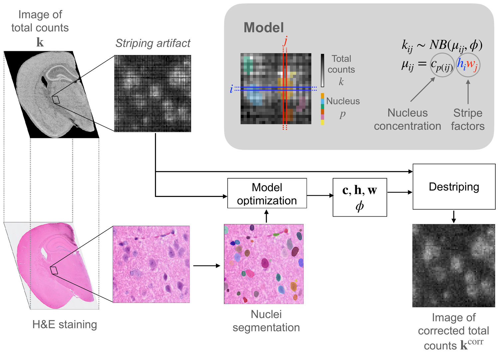

# destriping-GLM

This is a faster version of destriping-GLM (10x speedup 🚀). The earlier, slower implementation (as submitted to *Bioinformatics*, OUP) lives on the [`bioinformatics-OUP`](https://github.com/paolamalsot/destriping-GLM/tree/bioinformatics-OUP) branch; results are qualitatively the same.

---

## Motivation

10x Genomics VisiumHD enables spatial transcriptomics at ~2 μm² resolution but often exhibits **slide-specific, non-periodic striping artifacts** due to lane-width variability. These multiplicative row/column effects distort bin total counts and can bias downstream analyses.

---

## Method



We assume that the *true* size of the bin in row $i$ and column $j$ equals $h_i w_j$, where $h_i$ and $w_j$ are the corresponding horizontal and vertical lane widths, respectively. We further assume the total transcript concentration is homogeneous within nuclei, such that the expected value of total counts in bin $[i,j]$ is:

$$\mu_{ij} = c_{p(i,j)} \, h_i \, w_j$$


where $c_p$ is the total transcript concentration in nucleus $p$ and $p(i,j)$ denotes the nucleus to which bin $[i,j]$ belongs.

Finally, we model observed total counts $y_{ij}$ with a Negative Binomial distribution:

$$y_{ij} \sim \mathrm{NB}(\mu_{ij}, \phi) \,,$$

with mean $\mu_{ij}$ and dispersion parameter $\phi$.

### GLM parameterization

We fit nucleus concentrations and stripe factors jointly in a generalized linear modeling framework, with:

- **cross-validated regularization** on stripe factors $(\log(h_i), \log(w_j))$,
- **iterative dispersion estimation** for $\phi$,
- a correction step that converts the fitted parameters into a **destriped counts image**.

---

## Implementation

We fit the GLM with block coordinate descent, alternating L-BFGS steps in $(\log h, \log w)$ with Newton steps in $\log c$. This (+ other optimizations) results in a 10× speedup compared to the previous version, which used L-BFGS steps for all parameters.

⚡ We use the Python libraries [glum](https://github.com/Quantco/glum) and [tabmat](https://github.com/Quantco/tabmat), which are optimized for fitting generalized linear models with sparse design matrices \citep{schmidt_glum_2025}.

---

## Results (high level)

### Synthetic data (known ground truth)
- Improved stripe-factor estimation accuracy.
- Lower error in corrected counts compared to `bin2cell` and `bin2cell`-derived baselines.
- More accurate cell-typing.

### Public VisiumHD slides

On 4 datasets (mouse brain, mouse embryo, zebrafish head and human lymph node):
- Consistently lowers striping intensity.
- Better preserves biological structure present in global/large-scale count patterns.
- Avoids artifacts (e.g., macro-stripes/edge effects/reversed DGE effects) observed with sequential quantile normalization.

---

## Installation

This repo uses `pixi`.

```bash
pixi install
```

---

## Experiments

For reproducing the experiments, follow the instructions in [EXPERIMENTS.md](EXPERIMENTS.md).
